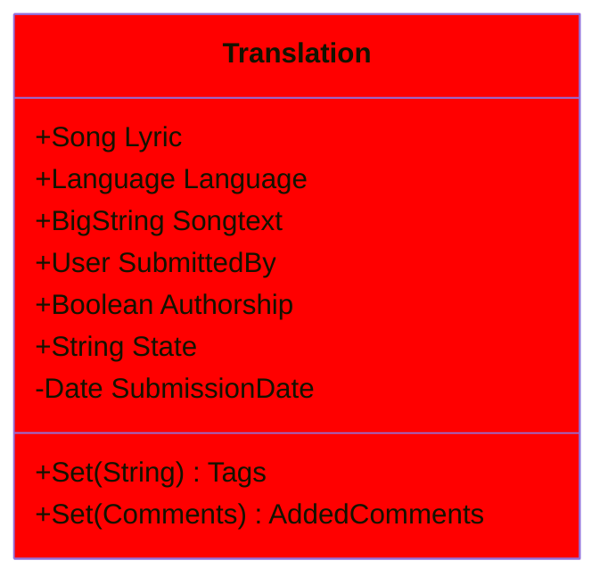
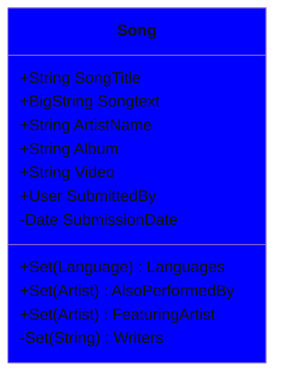
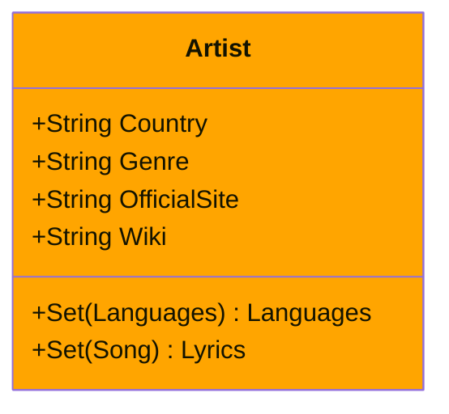
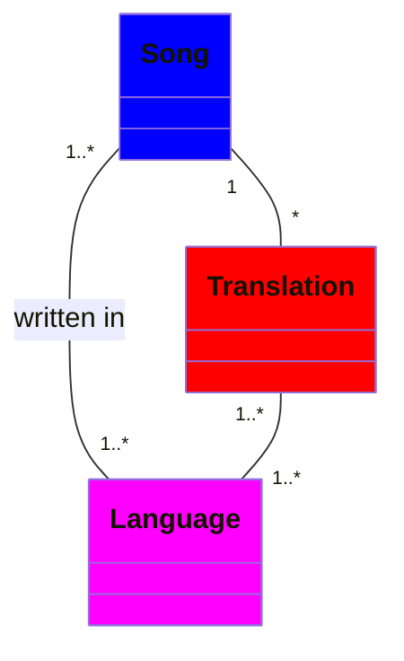
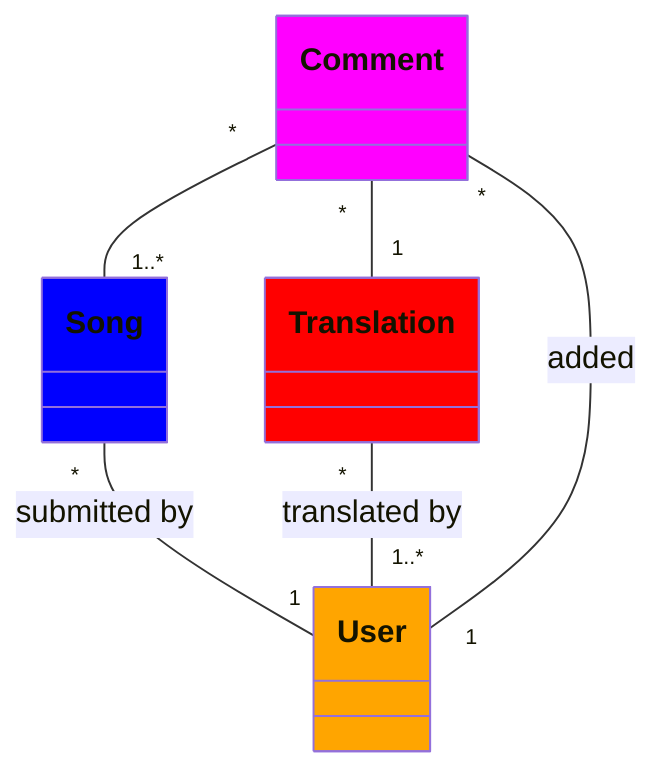
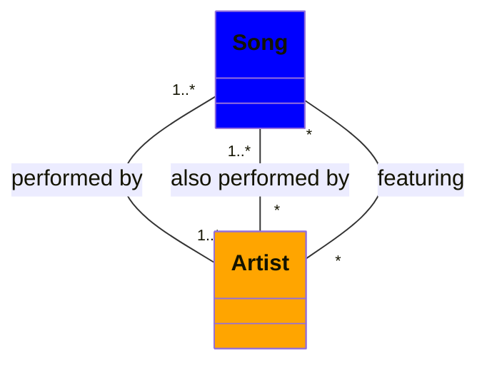

<!-- Author: J.A.Boogaard@hr.nl -->

# Class Diagrams

## Classes

### Translation

Een vertaling (Translation) bevat een verwijzing naar de Lyric (Song) en de gebruiker (User) die de vertaling heeft toegevoegd. Tijdens het toevoegen van de vertaling moet de gebruiker aangeven of hij de vertaling zelf heeft geschreven (Authorship). Er kunnen door de gebruiker één of meerdere tags (commented, poetic, singable, rhyming, metered, equithythmic) worden geselecteerd om aan de vertaling te worden toegevoegd. Na het publiceren kunnnen ook andere gebruikers een Comment toevoegen. Zie het State Digram voor de verschillende toestanden waarin een vertaling zich kan bevinden. 

### Song

Tijdens het publiceren kan de gebruiker een Comment toevoegen. Na het publiceren kunnnen ook andere gebruikers een Comment toevoegen. Alle geregristreerde gebruikers mogen een vertaling (Translation) aan een Song toevoegen. Tijdens het publiceren wordt er automatisch metadata toegevoegd die niet door een gebruiker kan worden aangepast.

### Artist

bij een artiest (Artist) wordt metadata opgeslagen zoals Country, Genre en links naar Websites. De set van talen (Languages) bevat de talen van de artiest gekoppelde Lyrics.

## Relationships

### Language

Bij deze website gaat het om vertalingen (Translation) maar Song is de verbindende Class. Een Song mag bestaan zonder Translation. Een User mag maar 1 vertaling in 1 taal (Language) per Song maken. Omdat meerder gebruikers vertalingen mogen toevoegen kan een Song meerdere vertalingen in dezelfde taal hebben (zie bijvoorbeeld <a href="https://lyricstranslate.com/en/tali-fighter-lyrics">Tali - Fighter</a>).

### User

Een Song kan maar door 1 User gepubliceerd worden. Voordat een User kan publiceren moet deze eerst worden geregistreerd. Een User kan dus geen of meerdere Songs, vertalingen en commentaren hebben gepubliceerd.

### Artist

Een Artist kan alleen bestaan als er minstens 1 Song aan is gelinkt.  

Er kunnen op verschillende manier meerdere artiesten betrokken zijn bij dezelfde Song:
<ul>

<li>Als duo of groep; dit is gemodelleerd als 1 Artist instantie bijvoorbeeld <a href="https://lyricstranslate.com/en/suzan-freek-lyrics.html">Suzan & Freek</a></li>

<li>Een tijdelijke samenwerking waarbij er 1 hoofdartiest (Artist) is en 1 of meerdere instanties van een toegevoegde Artist, bijvoorbeeld <a href="https://lyricstranslate.com/en/hatik-perdant-magnifique-lyrics.html">Featuring artist Soprano</a> 
</li>

<li>
Een Song is door meerdere artiesten worden gecovered (geen samenwerking maar wel toestemming), bijvoorbeeld <a href="https://lyricstranslate.com/en/Sylvie-Vartan-La-Maritza-lyrics.html">Also performed by: Camélia Jordana, Therion</a>
</li>

</ul>

## References
<ul>

<li>
<a href="https://mermaid.js.org/syntax/classDiagram.html">Mermaid Class diagrams</a>
</li>

<li>
<a href="https://gist.github.com/lqvers/05b06f344fa27b16235416b185f935d7">Quick Reference Mermaid diagrams</a>
</li>

<li>
<a href="https://www.uml-diagrams.org">Unified Modeling Language</a>
</li>

<li>
<a href="https://lyricstranslate.com">Lyrics Translations</a>
</li>

</ul>