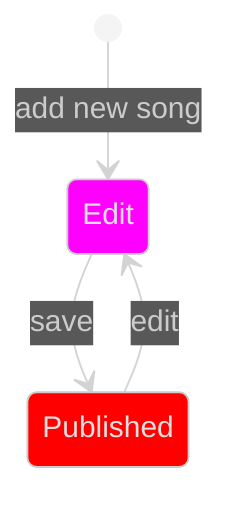
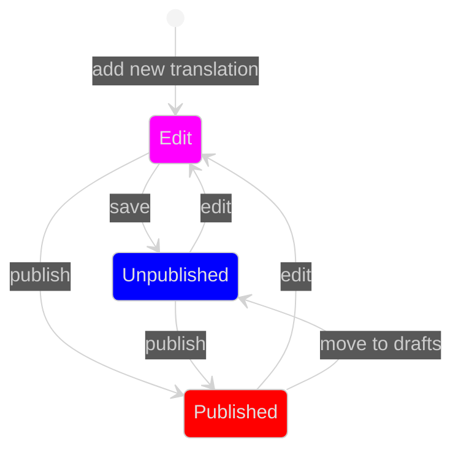
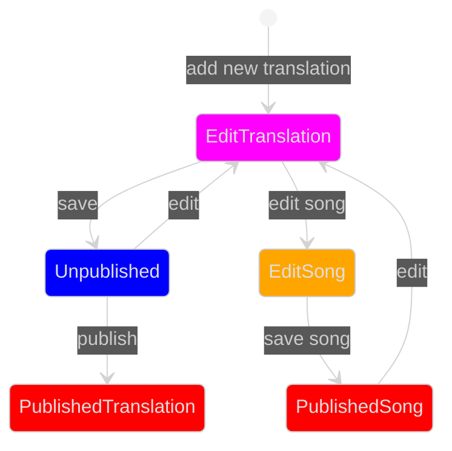

<!-- Author: J.A.Boogaard@hr.nl -->

# State Diagrams

## Song

Een Lyric wordt vertegenwoordigd door een Song object. Toevoegen van een Song vindt plaats vanaf de webpagina van de (hoofd)artiest via <i>add new song</i>.

## Translation

Een vertaling (Translation) wordt aangemaakt als toegvoeging (Add) aan een Song. Na deze <i>start state</i> kan de vertaling worden bewerkt (Edit), opgeslagen (Save as Unpublished) en gepubliceerd (Publish). Na Published volgt geen <i>end state</i> want een gepubliceerde vertaling kan worden aangepast (Edit) of worden teruggeplaatst naar Unpublished (Move to drafts). 

--

Als de auteur van de vertaling dezelfde User is die ook de Song heeft gepubliceerd, kan tijdens het bewerken van de vertaling (Edit) ook de Song worden bewerkt.

## References

<ul>

<li>
<a href="https://mermaid.js.org/syntax/stateDiagram.html">Mermaid State diagrams</a>
</li>

<li>
<a href="https://www.uml-diagrams.org">Unified Modeling Language</a>
</li>

<li>
<a href="https://lyricstranslate.com">Lyrics Translations</a>
</li>

</ul>